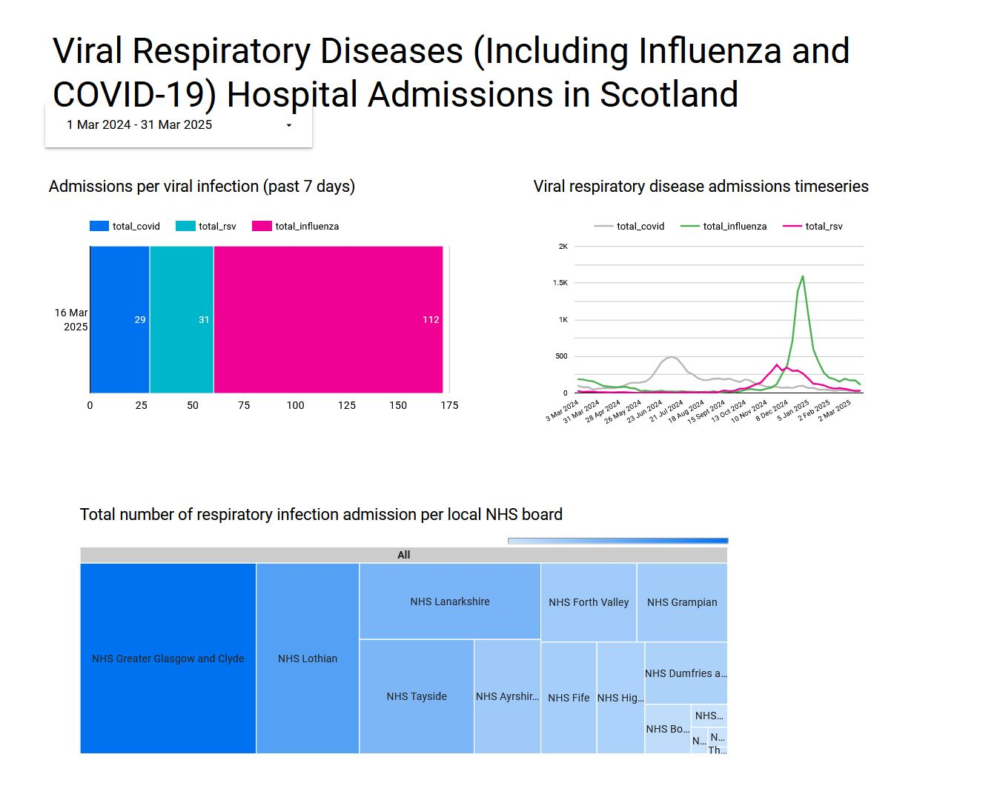

## ​Viral Respiratory Diseases (Including Influenza and COVID-19) Hospital Admissions in Scotland 

This is a capstone project for [Data Engineering Zoomcamp 202](https://github.com/DataTalksClub/data-engineering-zoomcamp).

#### Problem Statement

Respiratory infectious diseases, including COVID-19, influenza, and other non-influenza respiratory pathogens, pose significant public health challenges in Scotland. The burden of these diseases fluctuates seasonally, with the highest impact typically occurring during the winter months, thus, there is a need for improved data visualization and analysis tools to support public health officials  and healthcare providers in making timely, data-driven decisions.

#### Objective

This project aims to develop a data pipeline that enables insight into respiratory disease hospital admission data in Scotland. As a result, this will enable better monitoring, early detection of outbreaks, and more informed decision-making to mitigate the impact of respiratory infections on public health.

#### Dataset

The data used for this project was obtained from [Scottish Health and Social Care Open Data](https://www.opendata.nhs.scot/dataset/viral-respiratory-diseases-including-influenza-and-covid-19-data-in-scotland).

#### Tech Stack

* **Git** (version control)
* **Docker** (containerization)
* **Terraform** (infrastructure as code)
* **Kestra** (orchestration)
* **dbt** (data transformation)
* **Looker Studio** (data visualization)
* **Google Cloud Platform** (cloud provider)
    * **Compute Engine** (environment)
    * **Google Cloud Storage** (data lake)
    * **BigQuery** (data warehouse)

#### Data architecture

#### Data pipeline

1. The data is fetched from the [Scottish Health and Social Care Open Data](https://www.opendata.nhs.scot/dataset/viral-respiratory-diseases-including-influenza-and-covid-19-data-in-scotland) using [CKAN API](https://ckan.org/features/api) weekly. The files are then stored into Google Cloud Storage bucket.
2. Every week (Monday midnight schedule) Kestra will fetch the new data for the week, ingest it in the data lake and ingest them into a oartitioned table in BigQuery.
3. A dbt Cloud job will then process the weekly data into fact tables and dimension tables for the analytics. Task such as joining the disease types tables and region zone lookup tables are transformed using SQL.
4. Every week, the tables are then loaded into Looker studio to display metrics such as the total weekly infections per disease, the time series trend of the infection and the number of infections per local NHS board.

Preview of the Dashboard:

It can be accessed at this [link](https://lookerstudio.google.com/reporting/a6175b18-877f-4cd7-95ee-0cee49ce640a)

#### Setup

Prerequisites (click on each to go to their installation page):
* Git
* Terraform
* VSCode

The following steps will need to be done to replicate this project. To get more details, click on the links in the steps to get more detailed explanations.

1. Setting up the Google Cloud Project and obtain a Service Account login.
2. Run terraform to create the Cloud environment (Compute Engine VM, Google Cloud Storage bucket, BigQuery).
3. Setting up Kestra docker and setup the connection with GCP.
4. Setup your dbt Cloud project and the dbt Cloud job.
